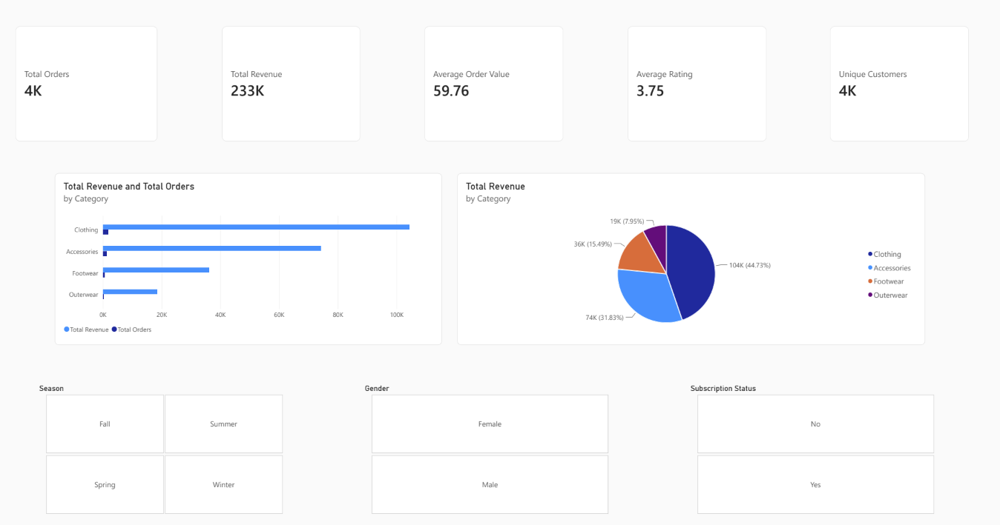
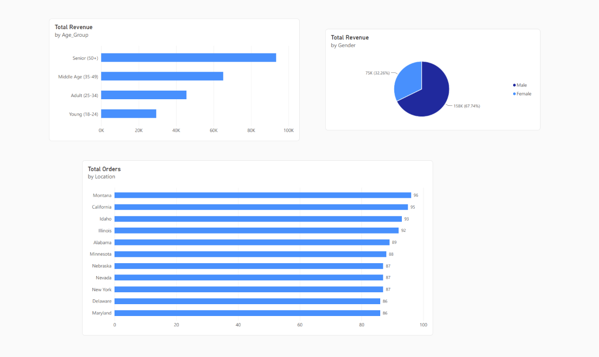

# E-Commerce Customer Behavior Analysis


---

## Project Overview

This is a complete **end-to-end Data Analyst portfolio project** that analyzes customer shopping behavior for an online retail store. The project covers the full analytics lifecycle — from raw data to actionable business recommendations and an interactive Power BI dashboard.

**Business Objective:**
Help the company understand customer purchasing patterns, identify high-value segments, evaluate the impact of discounts and subscriptions, and provide data-driven recommendations to increase revenue and customer retention.

---

## Dataset

- **Source:** Customer Shopping Behavior Dataset
- **Records:** 3,900 customer transactions
- **Features:** 18 columns including demographics, purchase details, product attributes, and behavioral signals
- **Key Columns:** Customer ID, Age, Gender, Item Purchased, Category, Purchase Amount (USD), Location, Season, Review Rating, Subscription Status, Discount Applied, Promo Code Used, Previous Purchases, Payment Method, Frequency of Purchases

---

## Tools & Technologies

| Tool                           | Purpose                      |
| ------------------------------ | ---------------------------- |
| **Python**               | Data loading, cleaning, EDA  |
| **Pandas**               | Data manipulation            |
| **Matplotlib & Seaborn** | Data visualization           |
| **SQL (SQLite)**         | Business analysis & querying |
| **Power BI**             | Interactive dashboard        |
| **Git & GitHub**         | Version control & portfolio  |

---

## Project Structure

```
Ecommerce-Customer-Behavior-Analysis/
├── data/
│   ├── raw/
│   │   └── customer_shopping_behavior.csv
│   └── processed/
│       └── customer_shopping_cleaned.csv
├── notebooks/
│   ├── 01_Data_Loading_Cleaning.ipynb
│   ├── 02_EDA_Customer_Behavior.ipynb
│   └── 03_SQL_Analysis.ipynb
├── powerbi/
│   └── Customer_Behavior_Dashboard.pbix
├── sql/
│   └── business_queries.sql
├── reports/
│   └── Project_Report.md
├── images/                  # Dashboard screenshots
├── requirements.txt
└── README.md
```

---

## Project Workflow

1. **Business Understanding** – Defined clear problem statement and success metrics
2. **Data Loading & Cleaning** – Handled missing values, created new features (Age Group, High Value Customer flag)
3. **Exploratory Data Analysis (EDA)** – Uncovered patterns in revenue, categories, gender, seasons, and subscriptions
4. **SQL Analysis** – Performed structured business queries using SQLite
5. **Power BI Dashboard** – Built interactive multi-page dashboard with KPIs, slicers, and visuals
6. **Insights & Recommendations** – Delivered actionable business recommendations

---

## Key Insights

1. **Clothing** is the highest revenue-generating category, contributing the largest share of total sales.
2. **Subscription customers** show significantly higher average spend and more previous purchases compared to non-subscribers.
3. **Male customers** contribute a higher overall revenue share, although spending patterns vary by category.
4. **Spring and Fall** seasons demonstrate stronger sales performance compared to other seasons.
5. **High-Value Customers** represent a smaller segment of the customer base but drive a disproportionately large share of total revenue.
6. Discount and promo code usage show measurable impact on order volume and average order value.
7. Middle-aged (35-49) and Senior (50+) age groups are strong contributors to overall revenue.

---

## Business Recommendations

1. **Boost Subscription Conversion**Launch targeted campaigns to convert non-subscribers, as subscribed customers demonstrate higher lifetime value.
2. **Strengthen Clothing Category**Increase marketing investment and inventory focus on Clothing while exploring cross-sell opportunities in Footwear and Accessories.
3. **Retain High-Value Customers**Introduce a dedicated loyalty program with exclusive benefits, early access, and personalized offers for high-value customers.
4. **Optimize Seasonal Strategy**Plan inventory and marketing campaigns in advance for Spring and Fall to capitalize on peak performance periods.
5. **Refine Discount Strategy**Move from broad discounts to targeted, segment-specific promotions for better margin control and effectiveness.
6. **Gender-Based Merchandising**
   Maintain strong focus on male customers while developing tailored product lines and campaigns for female shoppers.

---

## Dashboard

Interactive Power BI dashboard includes:

- Executive KPI cards (Total Revenue, Orders, Customers, AOV, Rating)
- Category performance analysis
- Gender and subscription impact
- Seasonal trends
- Age group and high-value customer analysis
- Interactive slicers for filtering

## Dashboard Screenshots

### 1. Executive Overview



### 2. Customer Insights



### 3. Product & Discount Analysis


---

## How to Run This Project

1. Clone the repository:

   ```bash
   git clone https://github.com/abdullah-ghaffar/Ecommerce-Customer-Behavior-Analysis.git
   cd Ecommerce-Customer-Behavior-Analysis
   ```
2. Install dependencies:

   ```bash
   pip install -r requirements.txt
   ```
3. Run the Jupyter notebooks in sequence:

   - `01_Data_Loading_Cleaning.ipynb`
   - `02_EDA_Customer_Behavior.ipynb`
   - `03_SQL_Analysis.ipynb`
4. Open the Power BI file:

   - `powerbi/Customer_Behavior_Dashboard.pbix`

---

## Author

**Abdullah Ghaffar**
Aspiring Data Analyst

- LinkedIn: [www.linkedin.com/in/abdullah-ghaffar](https://www.linkedin.com/in/abdullah-ghaffar/)
- GitHub: [github.com/abdullah-ghaffar](https://github.com/abdullah-ghaffar)
- Email: [abdullahghaffar.work@gmail.com](mailto:abdullahghaffar.work@gmail.com)

---

## License

This project is open-source and available under the MIT License.
